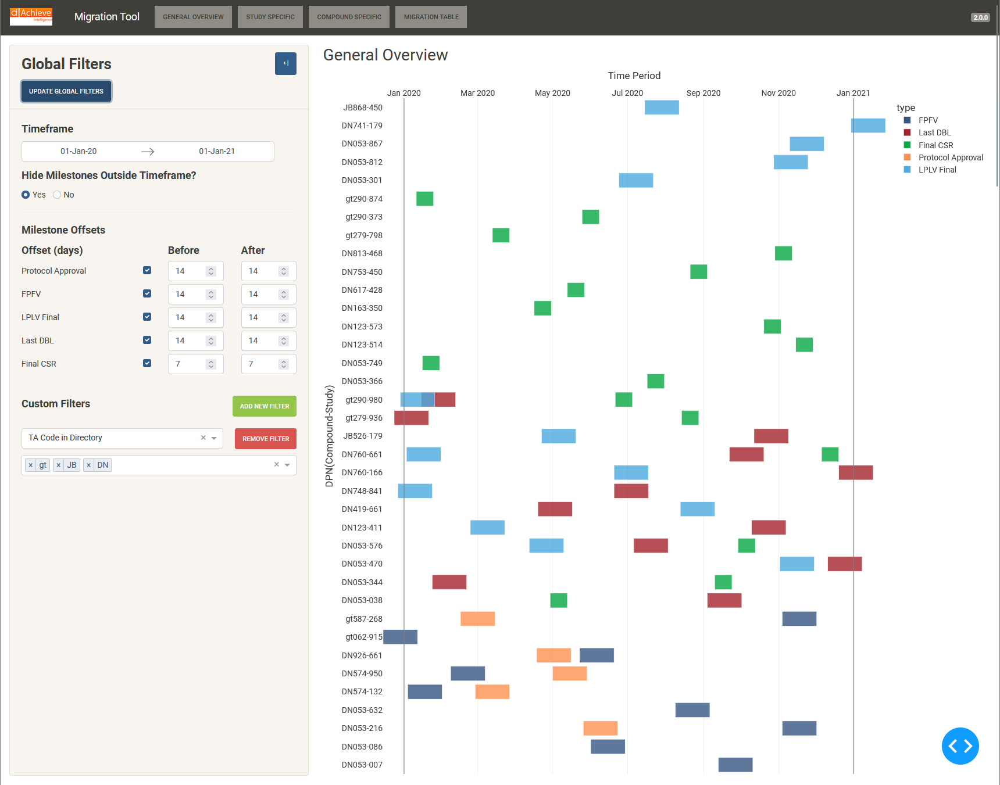

# Study Migration Tool

A Plotly-Dash Python application developed by [Achieve Intelligence](https://www.achieveintelligence.com/) that 
generates visualisations of study milestone activity for analysis and migration scheduling.

Achieve Intelligence offers a fully validated version of this tool. For enquires regarding this validated version, 
please contact Achieve Intelligence via email at: [info@achieveintelligence.com](info@achieveintelligence.com)

## Setup & Installation

By default, this application will attempt to load the example csv data provided with this repository. Please 
replace this example data and update the other configuration options found in config.py as required.

## Local

Create a virtual environment and run the `pip install -r requirements.txt` to install the required packages.

This application does not require any environment variables, however, when running locally app.run_server does default to 
the following variables if set:

    host: str = os.getenv("HOST", "127.0.0.1"),
    port: int = os.getenv("PORT", "8050"),
    proxy: str = os.getenv("DASH_PROXY", None)

## Cloud

See the following guides for deployment information suitable for this application:

[Azure - Python web app quickstart](https://learn.microsoft.com/en-us/azure/app-service/quickstart-python)

[AWS - Deploy python Flask](https://docs.aws.amazon.com/elasticbeanstalk/latest/dg/create-deploy-python-flask.html)

## Domino

Please see the [domino documentation](https://docs.dominodatalab.com/en/4.5/user_guide/de2589/publish-a-dash-app/) for 
more information on dash app publication with Domino.

## Usage

### Application Layout

The application comprises two main areas:

- Sidebar: Contains input fields and controls for filtering the data.
- Main Content Area: Displays the visualisations and tables generated based on the selected filters.

### General App Overview

On startup, this application will load source data and populate the main study activity overview of milestone 
activity following the configuration specified in config.py.

Coloured blocks of activity are shown in the visualisations that represent the milestone dates from your source data 
plus/minus the offsets specified on the collapsable menu to the left of the screen. The timeframe and milestones 
located on this menu can be modified at any time. 

The side menu also includes a "Hide Milestones Outside Timeframe" option which can be used to temporarily 
override the timeframe and return to a complete activity overview.

Below this main overall activity view, additional search functionality is provided to generate study or compound 
specific timeline views as required.

All the graphs provide additional information on milestone activity when hovering alongside several different tools 
and utilities in a menu located in the top right corner. The legend on these graphs is also interactive, allowing 
you to quickly toggle the visibility of specific milestones on click.

In version 2 of this tool, a `Migration Table` section and additional custom filters were added. These custom filters 
can be applied from the sidebar to any columns and affect both the graphs and the migration table. More information 
about the migration table can be found [here](#migration-table).

### Filtering Data (Global Configuration)

Use the sidebar controls to configure the visualisations and migration table as follows:

- Timeframe: Specify the desired timeframe for the visualisations or migration analysis. 
- Hide Milestones Outside Timeframe: This option can be used to override the timeframe in visualisations but does not 
affect the migration table.
- Milestone Offsets: Select the milestones to be included in the analysis by checking the corresponding checkboxes 
in the sidebar. The selected milestones will be used when generating the visualisations and migration table.
- Custom Filters: Apply additional filters by selecting column labels and their corresponding values. 
The available column labels depend on the dataset being used.

Click the "Update Global Configuration" button to update the graphs and tables based on the selected filters. The data 
will be processed, and the visualisations will be generated accordingly.

### Migration Table

The migration table provides insights into study migrations within defined time periods. Using the Global Filters, 
frequency, studies transferred per (day/week) and length of period (days/weeks) the application will attempt to find 
optimal migration dates for studies within the timeframe.

Studies are sampled for a migration date in order of their perceived migration difficulty (derived from the total length
of inactivity within the timeframe and the number of periods of inactivity).

The following controls are available for the migration table:

#### Study Transfer Calculator

This expansion panel allows you to calculate a rough estimate for *studies transferred per day or week* based on the following numbers:

- The *Working hours in a day* input allows you to specify on average how many hours per day you are able to transfer studies.
- The *Working days in a week* input allows you to estimate the number of working days in a week you will be working on transferring studies.
- The *Average size of study* input is the average size of all the studies in your dataset. This can be given in KB, MB, GB or TB.
- The *Average transfer rate* input is the average speed at which the studies can be migrated. This can be given in KB/s, MB, or GB/s.

This rough estimate can be overwritten by supplying a value to the *Studies transferred per day* input below the *study
transfer calculator* expansion panel.

#### Frequency and Day Length

The frequency control allows you to choose between migration periods measured in days or weeks.
For weekly migration periods, you can set the number of days in a week using the day length control.

#### Grouping Column

The grouping column dropdown allows you to select a column from the dataset for grouping studies.
Choose a suitable column to group studies and analyse migrations based on that grouping.

#### Period Length

Adjust the period length to define the duration of each migration period. The app will then calculate the number of 
periods which can fit inside the provided timeframe.

#### Generate Table

After configuring the migration parameters, click the "Generate Table" button to generate the migration table.
The table will display study migrations and periods of inactivity based on the selected parameters.

#### Download Migration

Clicking this button will download the information used to produce the table into two csv files:

- **migration_configuration_export_(timestamp).csv** which contains information on the configuration used when the 
migration table is generated.
- **migration_export_(timestamp).csv** which provides a complete overview about each study's migration.

## Upcoming Features

With the release of version 2, there are no new major features currently planned for the study migration tool. If 
you have any suggestions, please create a GitHub issue labelled enhancement.

## Contributing

We encourage you to contribute to the Study Migration Tool!

This application is built using Dash, which is a Python framework created by Plotly that uses Flask, Plotly.js and React 
under the hood. If you are unfamiliar with this framework, please see the [Dash documentation.](https://dash.plotly.com/)

To start contributing or report an issue, see our [Contribution Guidelines](/CONTRIBUTIONS.md).

## Support

For support, please contact the OpenSCE community.

## Licence

The Study Migration Tool is released under the GNU General Public Licence.
